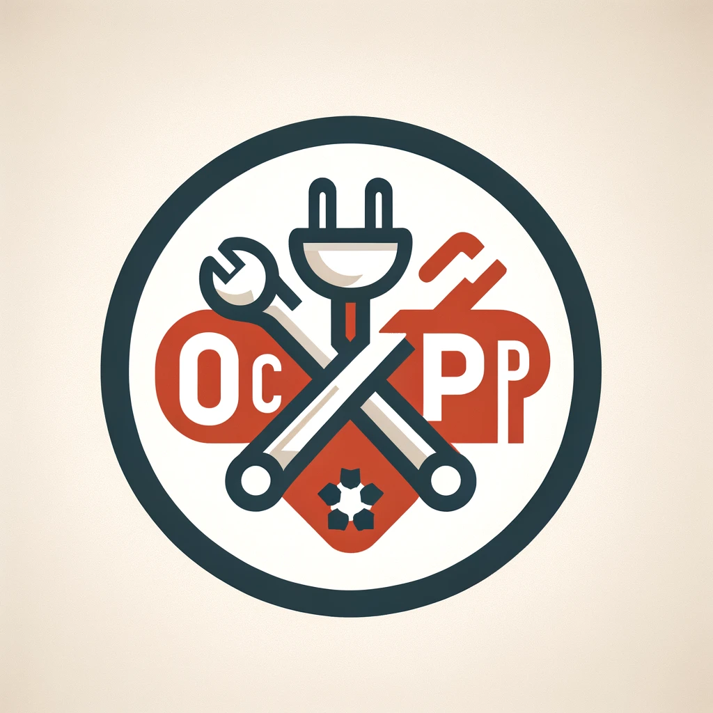

<a name="readme-top"></a>

<!-- PROJECT LOGO -->
<br />
<div align="center">
  <a href="https://github.com/othneildrew/Best-README-Template">
    
  </a>

  <h3 align="center">OCPP tools</h3>

  <p align="center">
    An awesome README template to jumpstart your projects!
    <br />
    <a href="#usage"><strong>Explore the docs »</strong></a>
    <br />
    <br />
</div>

<!-- TABLE OF CONTENTS -->
<details>
  <summary>Table of Contents</summary>
  <ol>
    <li>
      <a href="#about-the-project">About The Project</a>
    </li>
    <li>
      <a href="#getting-started">Getting Started</a>
      <ul>
        <li><a href="#prerequisites">Prerequisites</a></li>
        <li><a href="#installation">Installation</a></li>
      </ul>
    </li>
    <li>
      <a href="#usage">Usage</a>
      <ul>
        <li><a href="#validating-ocpp-json-messages">Validating OCPP JSON messages</a></li>
        <li><a href="#using-ocpp-interfaces">Using OCPP interfaces</a></li>
      </ul>
    </li>
    <li><a href="#roadmap">Roadmap</a></li>
    <li><a href="#license">License</a></li>
  </ol>
</details>

<!-- ABOUT THE PROJECT -->

## About The Project

**OCPP tools** is a collection of Open Charge Point Protocol message schemas, validation functions, utility types and typed interfaces for Typescript.

<p align="right">(<a href="#readme-top">back to top</a>)</p>

## Getting Started

Add ocpp-tools to your project using any package manager, or by cloning this repository.

### Prerequisites

This is an example of how to list things you need to use the software and how to install them.

- npm
- nodejs > 18.x

### Installation

```sh
npm install @cshil/ocpp-tools
```

<p align="right">(<a href="#readme-top">back to top</a>)</p>

<!-- USAGE EXAMPLES -->

## Usage

### Validating OCPP JSON messages

```typescript
import { isValidHeartbeatRequestV16, HeartbeatV15 } from "@cshil/ocpp-tools";

const data = JSON.parse("{}"")
const result = isValidHeartbeatRequestV16(data) //  => true

```

### Using OCPP interfaces

```typescript
import { AuthorizeResponseV16 } from "@cshil/ocpp-tools";

const message: AuthorizeResponseV16 = {
  idTagInfo: { status: "Accepted" },
};
```

<p align="right">(<a href="#readme-top">back to top</a>)</p>

<!-- ROADMAP -->

## Roadmap

- [x] Include OCPP v1.6 schemas
- [ ] Include OCPP v2.0.1 schemas

See the [open issues](https://github.com/connected-hil/ocpp-tools/issues) for a full list of proposed features (and known issues).

<p align="right">(<a href="#readme-top">back to top</a>)</p>

<!-- CONTRIBUTING -->

## Contributing

Any contributions you make are **greatly appreciated**.

If you have a suggestion that would make this better, please fork the repo and create a pull request. You can also simply open an issue with the tag "enhancement".
Don't forget to give the project a star! Thanks again!

1. Fork the Project
2. Create your Feature Branch (`git checkout -b feature/AmazingFeature`)
3. Commit your Changes (`git commit -m 'Add some AmazingFeature'`)
4. Push to the Branch (`git push origin feature/AmazingFeature`)
5. Open a Pull Request

<p align="right">(<a href="#readme-top">back to top</a>)</p>

<!-- LICENSE -->

## License

Distributed under the MIT License. See `LICENSE.txt` for more information.

<p align="right">(<a href="#readme-top">back to top</a>)</p>
